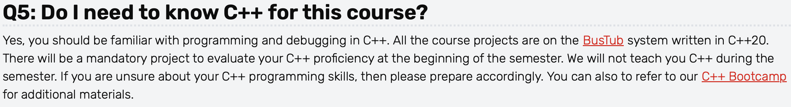

## C++ 现代语法特征训练营



> 本训练营旨在为你提供现代 C++ 编程的基础入门知识。C++ 语言的特性极为丰富且涉猎广泛，无法在一次训练营中全部涵盖，而且坦白说，这门语言最好通过实践来学习。工作人员相信，15-445 这门课程会让你成为一名更自信的 C++ 程序员！不过，我们确实会涉及一些在完成编程作业时必须掌握的 C++ 知识点。本教程不涵盖基础的 C/C++ 语法，主要介绍 C++ 的编程特性，尤其是那些 C 语言中不存在的概念。

本仓库主要记录个人对该训练营内容的学习过程，并整理原项目代码文件的结构，使得更易于上手和使用；同时对英文注释进行翻译，对暂时具有语言障碍的新手更加友好；最后对部分概念补充了一些简要的笔记，可供有需要的人参考。


## 索引表

| 序号 |             章节              |                             代码                             |                        笔记                         |
| :--: | :---------------------------: | :----------------------------------------------------------: | :-------------------------------------------------: |
|  1   | References and Move Semantics | <a href="1 - References and Move Semantics/references.cpp">references.cpp</a> |                         N/A                         |
|      |                               | <a href="1 - References and Move Semantics/move_semantics.cpp">move_semantics.cpp</a> |     <a href="notes/移动语义.md">移动语义.md</a>     |
|      |                               | <a href="1 - References and Move Semantics/move_constructors.cpp">move_constructors.cpp</a> | <a href="notes/移动构造函数.md">移动构造函数.md</a> |
|  2   |         C++ Templates         | <a href="2 - C++ Templates/templated_functions.cpp">templated_functions.cpp</a> |     <a href="notes/模版函数.md">模版函数.md</a>     |
|      |                               | <a href="2 - C++ Templates/templated_classes.cpp">templated_classes.cpp</a> |                         N/A                         |
|  3   |             Misc              |  <a href="3 - Misc/wrapper_class.cpp">wrapper_class.cpp</a>  |       <a href="notes/包装类.md">包装类.md</a>       |
|      |                               |       <a href="3 - Misc/iterator.cpp">iterator.cpp</a>       |       <a href="notes/迭代器.md">迭代器.md</a>       |
|      |                               |     <a href="3 - Misc/namespaces.cpp">namespaces.cpp</a>     |     <a href="notes/命名空间.md">命名空间.md</a>     |
|  4   |          Containers           |     <a href="4 - Containers/vectors.cpp">vectors.cpp</a>     |         <a href="notes/向量.md">向量.md</a>         |
|      |                               |        <a href="4 - Containers\sets.cpp">sets.cpp</a>        |         <a href="notes/集合.md">集合.md</a>         |
|      |                               | <a href="4 - Containers\unordered_maps.cpp">unordered_maps.cpp</a> |       <a href="notes\哈希表.md">哈希表.md</a>       |
|      |                               |        <a href="4 - Containers/auto.cpp">auto.cpp</a>        |         <a href="notes/auto.md">auto.md</a>         |
|  5   |            Memory             |    <a href="5 - Memory/unique_ptr.cpp">unique_ptr.cpp</a>    |     <a href="notes/智能指针I.md">智能指针I</a>      |
|      |                               |    <a href="5 - Memory\shared_ptr.cpp">shared_ptr.cpp</a>    |    <a href="notes/智能指针II.md">智能指针II</a>     |


## 构建方式

该训练营包含若干 C++ 代码文件，位于各章节目录下，建议深入研读。每个代码文件均可编译为与其同名的可执行文件。请使用 CMake 构建这些可执行文件，以下一组命令应能完成所有可执行文件的构建：

```cmake
$ mkdir build
$ cd build
$ cmake ..      // 调用CMake工具，去上级目录寻找CMakeLists.txt文件
$ make -j8      // 调用Make工具来执行编译，-j表示并行，8表示最多使用8个CPU核心 
```

执行这些命令后，生成的可执行文件将位于 `build` 目录中。例如， `1 - References and Move Semantics/references.cpp`  文件会编译为 `references` 可执行文件，位于 `./build` 目录下。其余代码文件亦是如此。


## 参考资源

虽然这次集训营力求尽可能全面，但它仍然只涵盖了使用现代 C++ 的基础内容，在你应用 C++ 构建大型程序的过程中，还需要查阅很多其它可用的资源。下面列举几例，它们的内容都非常全面（比这次集训营全面得多），但在可读性方面可能有所欠缺。但总的来说，我认为还是应该试着去阅读并理解这些资料，尤其是在做项目的时候。

1.  <a href="https://en.cppreference.com/w">cppreference</a>：非官方但相当准确的 C++ 和 C 标准摘要及示例
2.  <a href="https://cplusplus.com/">cplusplus</a>：包含 <a href="https://cplusplus.com/doc/tutorial/">C++语言教程</a> 和 <a href="https://cplusplus.com/reference/">C++库参考手册</a> 两部分内容
3.  <a href="https://github.com/changkun/modern-cpp-tutorial">《现代 C++ 教程》</a>：此GitHub仓库包含一些实用的信息和练习题


## 许可证

1. 本项目基于 <a href="https://github.com/cmu-db/15445-bootcamp">15445-bootcamp</a> 进行翻译和扩展，原项目版权（包括源代码文件）归属 <a href="https://github.com/cmu-db/15445-bootcamp/graphs/contributors">**原作者**</a> 所有，扩充的笔记内容归属本人所有，均遵循  <a href="LICENSE">Apache License 2.0</a> 协议。
2. 本仓库作为个人学习进度的记录，包括相关材料的整理备份、翻译和补充，并对有需要的人提供帮助。

