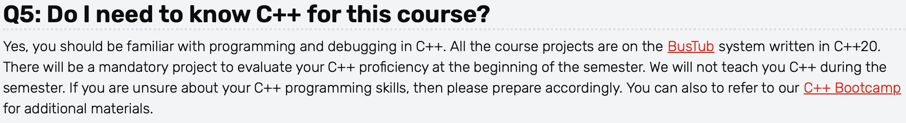

> [中文版本](README.zh.md) is also available.

[](https://github.com/ascendho/cpp-bootcamp/actions/workflows/build.yml)
[](LICENSE)
[](https://en.cppreference.com/w/cpp/17)
[](https://github.com/ascendho/cpp-bootcamp)

## C++ Modern Features Bootcamp



> This bootcamp aims to provide you with foundational knowledge of modern C++ programming. The C++ language is extremely rich and broad in its features — it cannot be fully covered in a single bootcamp, and frankly, this language is best learned through practice. The staff believes that the 15-445 course will make you a more confident C++ programmer! That said, we do cover some C++ concepts that are essential for completing the programming assignments. This tutorial does not cover basic C/C++ syntax; it focuses primarily on C++ programming features, especially concepts that do not exist in C.

This repository provides a structured, bilingual (English & Chinese) introduction to modern C++ — derived from CMU's 15-445/645 bootcamp and extended with detailed notes, translated code comments, and community contributions. It is designed for self-paced learning and as a reference for developers transitioning from C to modern C++.

## Index

|  #   |            Chapter             |                                                              Code                                                              |                            Notes                             |
| :--: | :----------------------------: | :----------------------------------------------------------------------------------------------------------------------------: | :----------------------------------------------------------: |
|  1   | References and Move Semantics  |       <a href="1 - References and Move Semantics/references.cpp">references.cpp</a>       |                             N/A                              |
|      |                                |     <a href="1 - References and Move Semantics/move_semantics.cpp">move_semantics.cpp</a>     |     <a href="notes/move-semantics.md">Move Semantics</a>      |
|      |                                | <a href="1 - References and Move Semantics/move_constructors.cpp">move_constructors.cpp</a> | <a href="notes/move-constructors.md">Move Constructors</a> |
|  2   |         C++ Templates          |       <a href="2 - C++ Templates/templated_functions.cpp">templated_functions.cpp</a>       |     <a href="notes/templated-functions.md">Templated Functions</a>     |
|      |                                |        <a href="2 - C++ Templates/templated_classes.cpp">templated_classes.cpp</a>         |                             N/A                              |
|  3   |             Misc               |            <a href="3 - Misc/wrapper_class.cpp">wrapper_class.cpp</a>             |       <a href="notes/wrapper-classes.md">Wrapper Classes</a>       |
|      |                                |                <a href="3 - Misc/iterator.cpp">iterator.cpp</a>                 |       <a href="notes/iterators.md">Iterators</a>       |
|      |                                |               <a href="3 - Misc/namespaces.cpp">namespaces.cpp</a>               |     <a href="notes/namespaces.md">Namespaces</a>     |
|  4   |           Containers           |              <a href="4 - Containers/vectors.cpp">vectors.cpp</a>               |         <a href="notes/vectors.md">Vectors</a>         |
|      |                                |                <a href="4 - Containers/sets.cpp">sets.cpp</a>                 |         <a href="notes/sets.md">Sets</a>         |
|      |                                |       <a href="4 - Containers/unordered_maps.cpp">unordered_maps.cpp</a>       |       <a href="notes/hash-maps.md">Hash Maps</a>       |
|      |                                |                <a href="4 - Containers/auto.cpp">auto.cpp</a>                 |         <a href="notes/auto.md">auto</a>         |
|  5   |             Memory             |             <a href="5 - Memory/unique_ptr.cpp">unique_ptr.cpp</a>             |    <a href="notes/smart-pointers-1.md">Smart Pointers I</a>    |
|      |                                |             <a href="5 - Memory/shared_ptr.cpp">shared_ptr.cpp</a>             |   <a href="notes/smart-pointers-2.md">Smart Pointers II</a>   |
|  6   |        Synch Primitives        |          <a href="6 - Synch Primitives/mutex.cpp">mutex.cpp</a>          |       <a href="notes/mutex.md">Mutex</a>       |
|      |                                |     <a href="6 - Synch Primitives/scoped_lock.cpp">scoped_lock.cpp</a>     |     <a href="notes/scoped-lock.md">Scoped Lock</a>     |
|      |                                | <a href="6 - Synch Primitives/condition_variable.cpp">condition_variable.cpp</a> |     <a href="notes/condition-variable.md">Condition Variable</a>     |
|      |                                |         <a href="6 - Synch Primitives/rwlock.cpp">rwlock.cpp</a>         |        <a href="notes/read-write-lock.md">Read-Write Lock</a>         |
|  -   |          spring2024           |              <a href="spring2024/s24_my_ptr.cpp">s24_my_ptr.cpp</a>              |                             N/A                              |

## Build

The bootcamp contains several C++ source files located under each chapter directory — it is recommended to study them in depth. Each source file compiles into an executable with the same name. Use CMake to build all executables:

```cmake
$ mkdir build
$ cd build
$ cmake ..      # invoke CMake to locate CMakeLists.txt in the parent directory
$ make -j8      # invoke Make to compile; -j enables parallel builds (8 CPU cores max)
```

After running these commands, the generated executables will be in the `build` directory. For example, `1 - References and Move Semantics/references.cpp` compiles to the `references` executable under `./build`. The same applies to all other source files.

## References

While this bootcamp strives to be as comprehensive as possible, it still only covers the fundamentals of using modern C++. As you apply C++ to build larger programs, you will need to consult many other available resources. Here are a few examples — they are all very comprehensive (far more so than this bootcamp), though they may be somewhat less approachable in terms of readability. That said, I believe it is still worth trying to read and understand these materials, especially when working on projects.

1. <a href="https://en.cppreference.com/w">cppreference</a>: an unofficial but fairly accurate summary of the C++ and C standards, with examples
2. <a href="https://cplusplus.com/">cplusplus</a>: includes both a <a href="https://cplusplus.com/doc/tutorial/">C++ language tutorial</a> and a <a href="https://cplusplus.com/reference/">C++ library reference</a>
3. <a href="https://github.com/changkun/modern-cpp-tutorial">Modern C++ Tutorial</a>: this GitHub repository contains useful information and practice exercises

## License

This project is based on <a href="https://github.com/cmu-db/15445-bootcamp">15445-bootcamp</a> from CMU, translated and extended with detailed notes. The original source code copyright belongs to the <a href="https://github.com/cmu-db/15445-bootcamp/graphs/contributors">**original authors**</a>. All content is licensed under <a href="LICENSE">Apache License 2.0</a>.

## Contributing

Contributions are welcome! See [CONTRIBUTING.md](CONTRIBUTING.md) for guidelines, and please follow our [Code of Conduct](CODE_OF_CONDUCT.md).
